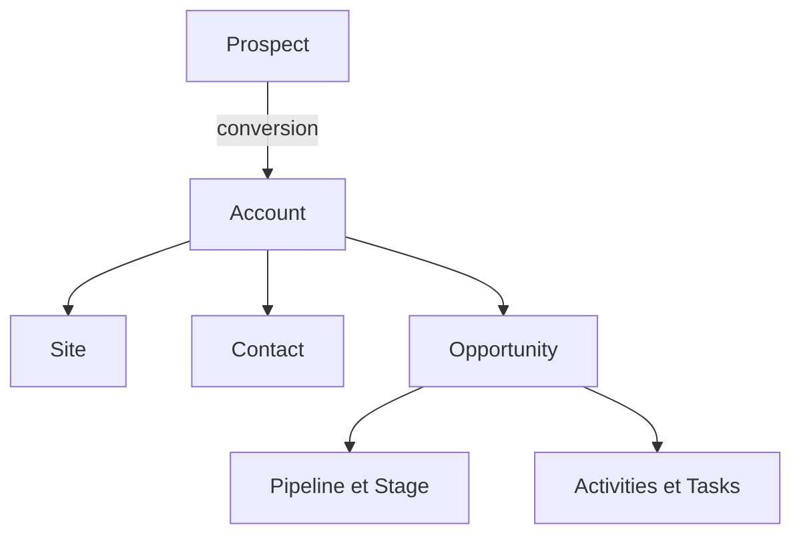

# LUKE CRM — Phase 1 : Prospects

## Vision
Outil commercial quotidien de ProTech Monte-Carlo : lecture immédiate, forte densité maîtrisée, actions rapides. Cette phase valide uniquement le board Prospects. Toutes les entreprises et personnes du prototype sont fictives.

## Principes UX
- Tableau opérationnel groupé, lignes compactes, statut visible sur toute la cellule.
- Les groupes sont repliables et signalés par une couleur et un rail vertical.
- Recherche, filtres et tri en haut de la table. La création se fait depuis la barre, le pied de groupe ou le bouton central mobile.
- Une modification de statut replace immédiatement le prospect dans son groupe. Sur mobile, chaque ligne devient une carte sans défilement horizontal.
- Aucun chiffre commercial réel, connexion, authentification ou persistance.

## Tokens
Fond `#F5F7F8`, surfaces `#FFFFFF`, texte `#222B37`, bordures `#E4E9ED`, accent de marque violet `#8271B4`. Statuts : nouveau bleu `#468DD4`, contact tenté rose `#D779A5`, contacté indigo `#6F8DBD`, qualifié turquoise `#2DA9A6`, à relancer orange `#E4A04C`, converti vert `#56AA76`. Rouge `#D96562` réservé aux problèmes, jaune `#D7B14F` aux attentes. Police système sans empattement, espacements de 4/8/12/16/20 px, rayons de 4 à 12 px, ombres légères.

## Architecture
`app/page.tsx` contient l'état du prototype et assemble la page. `components/prospects-ui.tsx` définit la navigation, la toolbar, la table, la carte mobile, les groupes et le formulaire. `components/prospect-cells.tsx` gère les cellules réutilisables. `data/prospects.ts` produit 26 prospects fictifs. `types/prospect.ts` définit les contrats. `app/globals.css` porte les tokens et les comportements responsive. Stack : React, TypeScript et Tailwind, sans dépendance à Replit.

## Décisions
La table affiche toutes les colonnes sur grand écran et permet un défilement interne sur les laptops. Les cartes prennent le relais sous 768 px. Le regroupement alternatif commercial/business line conserve l'édition de statut. Les modifications vivent uniquement en mémoire et sont perdues au rechargement. Les autres onglets n'affichent qu'un placeholder.

## Périmètre suivant, après validation
Confirmer la densité de la table, la nomenclature et les couleurs des statuts, les champs réellement indispensables en création rapide et le comportement des groupes. Ensuite seulement définir le modèle de données, les droits et les intégrations avant les autres modules.

## Phase 2 — fiche prospect (prototype)
La table ouvre une fiche latérale sur desktop, plein écran sur mobile. Elle regroupe coordonnées, société, responsable, statut, score, prochaine action et historique. Les coordonnées, le statut, le responsable et la prochaine action sont modifiables ; on peut ajouter une note datée. Les changements se répercutent dans la table pendant la session seulement. L'historique s'appuie désormais sur le modèle partagé `Activity` ; aucune API ou base réelle n'est branchée.

### Modèle relationnel cible à valider avant persistance
- **Groupe automobile** : entité mère facultative, liée à plusieurs comptes.
- **Compte / société** : personne morale (distributeur, concessionnaire ou client), éventuellement rattachée à un groupe. Une concession doit être un établissement lié à ce compte, avec son propre territoire et ses contacts.
- **Contact** : personne et moyens de contact, rattachée à un compte et éventuellement à un établissement. L'email ne doit pas être la seule clé métier.
- **Prospect** : qualification commerciale d'un contact dans une business line, avec responsable, statut, score, origine et prochaine action. Un même contact peut avoir plusieurs pistes sans dupliquer sa personne.
- **Activité** : note, appel, email, rendez-vous ou tâche, avec auteur, date, responsable et lien au prospect ainsi qu'au contact/compte si nécessaire.
- **Opportunité** : transaction potentielle issue d'un prospect qualifié, avec étapes, valeur, probabilité, échéance et business line. Une conversion ne doit pas supprimer l'historique.
- **Territoire / contrat de distribution** : droits et exclusivités distincts des comptes ; une même société peut agir sur plusieurs territoires et lignes d'activité.

### Droits et intégrations : décisions avant données réelles
Définir les rôles commerciaux, direction, administrateur et lecture seule, les périmètres territoriaux, la confidentialité des notes et l'historique des modifications. Clarifier l'identifiant maître et la synchronisation avec les sources de ventes produits, prestations, export, messagerie et agenda. Prévoir dédoublonnage, import contrôlé et propriété des comptes. Aucun accès aux données de ProTechMC ne doit être ouvert sur la base du prototype actuel.

## Phase 3 — Comptes, Contacts et hiérarchie client

### Règle centrale
Une société est représentée par **un seul Account**, quel que soit le nombre de Business Lines concernées. Une relation Services, Produits France, Export ou Network n'ouvre pas un compte supplémentaire. Les transactions futures appartiendront aux opportunités, pas à une copie du compte.

### Entités et clés
- `User` : `id`, nom, initiales et rôle. Les relations utilisent `ownerId` ; la liste `mockUsers` est la source des commerciaux fictifs.
- `Account` : `id`, nom, type, statut, `parentId | null`, `ownerId`, localisation, coordonnées, `lines[]`, résumé, dernière activité et prochaine action.
- `AccountSite` : `id`, `accountId`, nom, type, ville, pays et adresse. Un établissement appartient à un compte et n'est pas un second compte par défaut.
- `Contact` : `id`, `accountId` requis, `siteId | null`, `ownerId`, nom, fonction, département, rôle décisionnel, coordonnées, statut et prochaines actions. Fonction et rôle restent indépendants.
- `Prospect` : piste commerciale qui peut référencer `accountId` et `contactId`. Ces liens sont facultatifs tant que la conversion n'a pas été qualifiée ; le libellé libre de société reste utile avant le rapprochement.
- `Activity` : `subjectType` et `subjectId` lient une note, un appel, un email ou un rendez-vous à la fiche correspondante. Un composant partagé rend l'historique et crée les notes pour les trois modules.
- `Task` : référence une fiche, une échéance et un responsable ; création locale depuis les fiches Compte et Contact.
- `BusinessLine` : valeurs `Services`, `Produits France`, `Export`, `Network` ; relation plusieurs valeurs pour un même Account.
- `Opportunity` : réservée à la prochaine étape ; elle référencera un compte et éventuellement un contact/site, sans duplication de la société.

### Hiérarchie
`Account.parentId` permet groupe → société / entité. `AccountSite.accountId` permet société → sites. `Contact.accountId` est obligatoire et `Contact.siteId` optionnel. La fiche d'un groupe présente ses entités directes et les sites/contacts de ses enfants directs. Les données fictives couvrent plusieurs groupes et entreprises, distributeurs, revendeurs, importateurs et partenaires.

### Taxonomies
Types Account : Groupe automobile, Concession, Entreprise, Revendeur, Distributeur, Importateur, Spa for Cars, Partenaire, Client professionnel, Autre. Statuts : Prospect, Client actif, Partenaire, Dormant, Ancien client, À qualifier. Rôles de contact : Décideur, Influenceur, Acheteur, Utilisateur, Direction générale, Direction commerciale, Après-vente, Marketing, Technique, Finance, Autre. Ces valeurs sont centralisées dans `types/crm.ts`.

### Écrans et règles UX
Comptes et Contacts reprennent le board, les groupes repliables, les filtres et les cartes mobiles. Les fiches gardent l'apparence de la fiche Prospect. Comptes comprend Vue d'ensemble, Contacts, Sites, Activité, Business et un placeholder Opportunités. Les créations affichent un candidat doublon ; l'utilisateur peut ouvrir la fiche existante, annuler ou créer quand même. La similarité des noms de comptes est une comparaison normalisée simple ; les contacts comparent l'email ou le nom dans le même compte. Aucune fusion automatique.

Les liens Prospect → Compte/Contact sont actifs uniquement lorsqu'un rapprochement fictif cohérent existe. La conversion complète reste à développer avec le module Opportunités. Les actions `tel:` et `mailto:` sont disponibles sur les contacts ; les numéros et emails d'exemple sont fictifs et non destinés à un usage réel. Aucun backend, authentification, Gmail, Calendar, Sage ou IA n'a été ajouté. Les modifications se perdent au rechargement.

### Prochains arbitrages
Définir les règles métier de conversion et de propriété des comptes, la notion de site dans les réseaux multiterritoires, la visibilité des notes, puis la stratégie d'import et de dédoublonnage avant toute donnée réelle.

## Phase 4 — Opportunités, pipelines et conversion Prospect

Le prototype définit `Opportunity` comme un projet commercial lié par `accountId` à un `Account` (plusieurs opportunités par compte). `siteId` et `primaryContactId` sont facultatifs et pointent vers `AccountSite` et `Contact`. `ownerId` de l'opportunité est indépendant de l'Account Owner : il est proposé à la création à partir du compte et reste modifiable. Lorsqu'un compte enfant est créé, il hérite par défaut de l'Owner de son parent, avec possibilité de surcharge. Les sites héritent dans les mocks de l'Owner de leur compte et peuvent être réattribués dans la fiche Compte. Les pays, régions et territoires sont des propriétés de chaque site, jamais un étage de la hiérarchie juridique ; un groupe peut couvrir plusieurs pays.

`Pipeline` regroupe les `PipelineStage` dans `data/pipelines.ts`. Trois workflows sont actifs : Services, Produits France et Export. Chaque étape possède une probabilité et une couleur configurées au même endroit ; les issues terminales sont Won, Lost, Postponed, Abandoned ou Unqualified selon le pipeline. `BusinessLine` choisit le pipeline proposé à la création. Network possède désormais un pipeline minimal distinct « Network · à configurer », avec des étapes provisoires et ses propres identifiants. Le vrai workflow sera défini ultérieurement. Les commandes récurrentes ordinaires ne créent pas automatiquement d'opportunité.

Une opportunité ouverte requiert un Owner, une étape, une prochaine action et sa date. Le formulaire de création l'impose ; les mocks et l'édition peuvent contenir des lacunes pour vérifier les alertes. Une opportunité est signalée « À risque » si l'une manque, si l'action ou le closing est dépassé, ou si l’inactivité dépasse le seuil configuré pour son pipeline. Les dates sont comparées au jour local du navigateur. La probabilité par défaut vient de l'étape et peut être ajustée directement. `weightedAmount = amount × probability / 100` est recalculé à chaque modification. EUR, USD, GBP et AED sont affichés séparément sans conversion ni total multidevise trompeur.

La table propose recherche, filtres, tri, colonnes, groupes repliables, modification directe des champs clés, ainsi qu'une vue Kanban par pipeline avec changement d'étape par menu. La vue mobile utilise des cartes et des groupes verticaux repliables. « Mes opportunités » utilise l'utilisateur fictif `u1`. Forecast regroupe les montants ouverts, pondérés, gagnés et attendus ce mois par Owner, Business Line ou Pipeline, devise par devise. Dashboard et Documents sont des placeholders. Le passage en Won requiert confirmation, fixe la probabilité à 100 % et enregistre `wonAt` ; une tâche de suivi est facultative. Lost requiert `lossReason`, parmi les raisons configurées dans `data/pipelines.ts`, avec précision libre pour « Autre ».

La conversion ouvre trois étapes : sélection ou création explicite d'un compte, sélection ou création d'un contact, puis opportunité facultative. Les correspondances potentielles bloquent la création de doublons tant que l'utilisateur n'a pas choisi le compte/contact existant ou confirmé « créer quand même ». Le Prospect original reste présent, passe à Converti, conserve ses données et ses activités et reçoit `convertedAt`, `accountId`, `contactId` et éventuellement `opportunityId`. Aucun objet existant n'est recopié. Les activités et tâches utilisent les mêmes types partagés et des liens facultatifs par ID vers Prospect, Account, Contact et Opportunity. Toutes les mutations sont en mémoire et perdues au rechargement.

À confirmer avant une base réelle : le workflow Network, les règles de propriété des sites transfrontaliers, les probabilités, le seuil d'inactivité, la gestion des statuts Reporté/Abandonné et les règles de consolidation des devises. Aucune intégration, authentification ou automatisation n'est développée.

### Contrôle responsive préalable à la phase 5

Le contrôle visuel différé de la phase précédente a été repris aux largeurs de viewport exactes 375, 430, 768, 1024 et 1440 px. Prospects, Comptes, Contacts, Opportunités, Kanban, fiches, modal de création et conversion, menus de statut et Forecast ont été inspectés. Aucun débordement horizontal du document n’a été constaté ; les grandes tables gardent leur défilement horizontal interne et la vue Pipeline devient une pile de groupes sur mobile. Deux corrections mineures : éviter la répétition du message « Aucune prochaine action » sur les cartes et supprimer les séparateurs de devises vides dans Forecast ; la synthèse mensuelle vide affiche désormais un tiret.

## Phase 5 — Activités, tâches et Mon travail

### Modèle et relations
`Task` (`types/crm.ts`) porte ID, titre, description, `ownerId`, statut (`À faire`, `En cours`, `Terminée`, `Annulée`), priorité (`Basse`, `Normale`, `Haute`, `Urgente`), échéance et heure facultative, dates de création/mise à jour/fin, type et `activityId` facultatif. Les dix `TaskType` sont centralisés dans `taskTypes`. `completedAt` est attribué lors de la clôture. `Activity` porte un type parmi neuf choix, auteur, date, heure, contenu, résultat, participants, durée facultative et `nextActionCreated`. Les deux objets peuvent référencer Prospect, Account, Contact et Opportunity via quatre ID facultatifs (`CrmLinks`). Une seule activité multi-liens est stockée ; les timelines filtrent cette même collection par relation et ne créent pas de copies.

`currentUserId = u1` (Alice Martin) sert à Mon travail ; les autres propriétaires permettent de tester les filtres. Les mocks relationnels comprennent aujourd’hui, retard, avenir, terminé, appels, Meeting, notes et différents responsables. Tous les changements vivent dans l’état React de la session, sans persistance.

### Parcours quotidiens
Mon travail est la page d’entrée : salutation, cinq compteurs compacts filtrants, Aujourd’hui, En retard, À venir (demain / cette semaine / plus tard), À relancer et Opportunités à risque. Une vue Toutes les tâches propose onglets et filtres par owner, type, priorité, date, compte et opportunité. Terminer clôt la tâche immédiatement, propose un compte-rendu, puis demande une nouvelle prochaine action pour les tâches issues de Next Action. Reporter offre demain, trois jours, semaine prochaine ou une date choisie. L’historique des reports n’est pas conservé dans le mock ; un audit trail sera nécessaire avant persistance.

Une Next Action datée sur Prospect ou Opportunity crée ou actualise une Task marquée `sourceNextAction`, avec dédoublonnage sur la relation tant que la tâche précédente reste active. Prospect offre une case « Ajouter à Mon travail » activée par défaut. La création/édition d’une Opportunity datée synchronise automatiquement la tâche. Quand une telle tâche est achevée, l’utilisateur choisit la prochaine étape ou « Aucune pour l’instant ». Cette dernière option vide la Next Action ; une Opportunity ouverte devient alors « À risque : Aucune prochaine action ». Une nouvelle tâche issue d’un compte-rendu peut aussi mettre à jour la prochaine action liée.

Le + global propose Prospect, Compte, Contact, Opportunité, Tâche, Note, Appel et Meeting ; sur mobile, il ouvre une feuille de création. `QuickTaskForm` pré-remplit objet, compte et owner depuis les fiches. `QuickActivityForm` enregistre appels (résultat parmi sept choix), meetings (date, heure, participants, compte-rendu) et autres activités ; prochaine action et Task sont facultatives. Depuis Contact, « Appeler » ouvre le compte-rendu simulé, sans détection téléphonique. Le module Activités offre table sur desktop, cartes sur mobile, vues Toutes / Mes activités / Aujourd’hui / Cette semaine et filtres type, utilisateur, compte, opportunité et date.

La timeline partagée `ActivityTimeline` existante est conservée. La fiche Account agrège les activités directes, celles des contacts et opportunités du compte et, pour un groupe, de ses entités directes. Un événement de conversion relie Prospect, Account, Contact et Opportunity ; un changement d’étape d’Opportunity est aussi consigné. Les tâches liées sont listées dans les fiches avec leur état.

### Pipelines, devises et limites
`data/pipelines.ts` centralise les seuils provisoires d’inactivité : Services 14 jours, Produits France 21, Export 30, Network 30. La configuration par étape sera possible plus tard. Network a un pipeline minimal séparé et affiché « à configurer ». Forecast conserve EUR, USD, GBP et AED séparément ; une future devise de consolidation EUR exigera des taux de change et des règles de date validés. Aucune base réelle, authentification, permissions, messagerie, agenda, téléphonie, IA, automatisation avancée, stock ou facturation.

### Vérifications
Le gate de la phase précédente est consigné plus haut. Cette phase a été compilée avec TypeScript et build de production. Contrôle visuel de Mon travail et Activités à 375, 430, 768, 1024 et 1440 px : pas de débordement du document, cartes mobiles sans grand tableau, table Activités réservée au desktop. Capture des dispositions 375 et 1024 ; correction d’accès à Activités dans « Plus » mobile. Parcours vérifiés dans le navigateur : création d’une tâche liée, clôture puis invitation au compte-rendu, report à demain, création d’un appel avec résultat et lien Contact/Account, Next Action Opportunity → Task, Task terminée → demande de prochaine étape → signalement sans Next Action. Le champ date de l’édition Opportunity lit sa valeur native à l’enregistrement pour fiabiliser la saisie.

## Phase 6 — socle persistant (jeu fictif)

### Architecture
La page CRM existante reste le produit principal. La couche UI (`components/crm-app.tsx`, modules existants) reçoit un snapshot serveur ; `hooks/use-persisted-collection.ts` sérialise les changements et restaure les données après échec. Les requêtes passent par `app/api/crm/**`, puis les services `server/auth.ts`, `server/repository.ts`, `server/admin.ts` et `server/normalize.ts`, enfin par le binding relationnel D1 `DB`. Aucun composant React n’importe le binding D1. `app/page.tsx` exige l’identité ChatGPT au rendu ; les API vérifient indépendamment l’identité, le rôle, l’action et le scope. Un indicateur d’enregistrement et une alerte avant fermeture évitent de prendre une mutation en cours pour une sauvegarde confirmée ; en cas d’échec, le snapshot serveur restaure la collection concernée et affiche un message.

Le schéma source est `db/schema.ts`, les migrations Drizzle sont dans `drizzle/`. Les 22 tables comprennent `users`, `teams`, `roles`, `permissions`, `role_permissions`, `accounts`, `account_sites`, `contacts`, `prospects`, `opportunities`, `pipelines`, `pipeline_stages`, `activities`, `tasks`, `task_history`, `business_lines`, `territories`, `currencies`, `exchange_rates`, `loss_reasons`, `audit_logs` et `seed_state`. Les entités conservent leurs champs UX dans `payload` JSON et exposent en colonnes indexées les identifiants, propriétaires, relations, dates et montants critiques. Les clés étrangères portent les relations ; les nouvelles entités utilisent UUID v4, à l’exception du Prospect dont l’interface actuelle conserve un identifiant numérique aléatoire stable. Les IDs historiques fictifs (`a1`, `o1`, etc.) restent stables lors du seed. Une migration ultérieure vers PostgreSQL peut conserver ces colonnes relationnelles et convertir `payload` en JSONB, puis normaliser progressivement les champs métier.

`Account.ownerId` et `Opportunity.ownerId` restent indépendants. Le Site propose l’Owner du compte parent et peut être réassigné. Les suppressions API sont logiques (`deleted_at`, `deleted_by`) ; les listes ordinaires excluent ces lignes. Les index couvrent noms de comptes, emails des contacts, propriétaires/étapes/prochaines actions des opportunités, responsable/échéance des tâches et date des activités. Les champs de comparaison normalisés (nom, email, téléphone, domaine et identifiant fiscal facultatif) coexistent avec les valeurs affichées. Le service `/api/crm/duplicates` retourne les candidats sans fusion automatique.

### Jeu de données et transactions
La première requête authentifiée d’un site privé vierge installe une seule fois le jeu `fictional-v1` via un batch D1 atomique : comptes, sites, contacts, prospects, opportunités, activités, tâches, pipelines et utilisateurs fictifs des phases précédentes. Aucune pièce du dossier financier joint ni aucune donnée client ProTechMC réelle n’est importée. Le marqueur `seed_state.kind = fictional-only` évite un second seed. `scripts/reset-dev-data.mjs`, avec confirmation explicite et `--local`, ne vise que la base de développement. La conversion Prospect est traitée par `/api/crm/convert` en un batch atomique : rattachement/création Account et Contact, éventuelle Opportunity, mise à jour du Prospect, activité de conversion, éventuelle Task et audit. Un échec SQL annule le batch.

### Utilisateurs, autorisations et audit
L’identité provient de la connexion native ChatGPT du Site privé ; aucune donnée de mot de passe n’est créée par LUKE. Huit profils fictifs et quatre équipes (`Services France`, `Sales France`, `Export`, `Management`) sont préparés. Le propriétaire authentifié lors du premier seed est associé au profil `u1` SUPERADMIN ; les autres profils ne sont pas connectables avant association par un administrateur à des adresses ChatGPT autorisées à accéder au Site. Les rôles `SUPERADMIN`, `DIRECTION`, `SALES_MANAGER`, `COMMERCIAL`, `CHARGE_AFFAIRES`, `ADMIN_COMMERCIAL`, `READ_ONLY` portent leurs permissions par action et scopes `OWN`, `TEAM` ou `ALL` dans des tables distinctes. `READ_ONLY` n’a aucun droit de mutation ; les requêtes API refusent les actions non autorisées, y compris lorsqu’un client les envoie directement. Le périmètre TEAM est la Team principale de l’Owner ; une relation plusieurs Teams pourra être ajoutée ultérieurement.

L’Administration permet de consulter/éditer utilisateurs, rôle, équipe, statut actif et adresse de connexion, de gérer les équipes, de saisir des taux EUR manuels et de modifier les seuils d’inactivité. Chaque création, modification, suppression logique, changement d’Owner, d’étape, de montant, statut Won/Lost et conversion écrit `audit_logs`. Chaque report de tâche écrit également `task_history` avec ancienne/nouvelle échéance, auteur et heure ; la dernière entrée est discrètement lisible dans Mon travail. Le changement de rôle a l’action `role.change`. Les logs techniques restent côté serveur et les erreurs affichées sont formulées pour l’utilisateur.

### Network et devises
Le pipeline Network définitif, propre à la Business Line, possède les douze étapes proposées (de Cible identifiée à Partenaire actif) et les issues Perdu, Reporté, Non qualifié. Les seuils 14/21/30/30 jours sont enregistrés dans `pipelines.inactivity_days`, transmis au client dans le snapshot et modifiables dans l’Administration. Un futur seuil par étape nécessitera un champ supplémentaire sur `pipeline_stages`.

`opportunities.native_amount`, `currency`, `exchange_rate_snapshot`, `exchange_rate_date`, `amount_eur` conservent la valeur d’origine et le taux appliqué. `exchange_rates` contient devise de base, devise de cotation EUR, taux, date d’effet, source « Saisie manuelle », auteur et création. La consolidation utilise le dernier taux applicable à la date du calcul ; une mise à jour administrative du taux ne modifie pas les snapshots existants. Le bouton « Actualiser le taux EUR » exige `admin.rates` côté serveur. Forecast continue d’afficher les montants natifs séparés et ajoute l’équivalent EUR connu avec un avertissement « Taux manquant » si une affaire ouverte n’a pas de snapshot. Cette somme EUR est alors signalée comme incomplète.

### Portage vers Replit / PostgreSQL
Conserver l’interface et les contrats API ; remplacer `server/repository.ts` et le binding D1 dans `server/auth.ts`/`server/admin.ts` par un adapter PostgreSQL (transactions et JSONB), appliquer les migrations SQL correspondantes et tester les mêmes permissions. Remplacer l’adapter d’identité `app/chatgpt-auth.ts` par un fournisseur d’authentification fiable en maintenant un identifiant externe stable dans `users.auth_id`. Variables d’environnement cibles : URL/identifiants PostgreSQL et configuration d’authentification gérés en secrets. Aucun token n’est enregistré dans le dépôt. L’import futur devra appeler les services métier avec contrôle de doublon, validation, attribution et audit ; aucun import/export métier massif n’est implémenté ici.

### Vérifications et limite actuelle
En local, la migration D1 a été appliquée ; le seed a produit 18 comptes, 22 contacts, 26 prospects, 26 opportunités, 13 activités et 12 tâches initiales. Une tâche créée, reportée et son historique ont survécu au rechargement. Un compte et un contact liés ont été créés ; une conversion a persisté Prospect, Contact, Opportunity, Task et audit en une transaction. Un taux fictif USD→EUR a été saisi puis appliqué avec snapshot conservé après rechargement. Six assertions pures des scopes OWN/TEAM/ALL passent. Les pages Mon travail et Administration ont été contrôlées à 375, 430, 768, 1024 et 1440 px sans débordement horizontal. Le contournement d’identité local et la route temporaire de contrôle visuel ont été supprimés ; TypeScript, build et `git diff --check` passent. Le lint global signale 33 erreurs et 31 avertissements, dont des règles React sur les effets préexistants et des types `any` dans ce socle ; ce gate reste ouvert.

Les tests directs sous quatre identités réelles et la reconnexion de ces profils restent à réaliser : le Site est owner-private et les autres profils fictifs n’ont pas d’identité ChatGPT associée. L’association d’une adresse de connexion à un profil de test a été bloquée par la revue automatique des accès ; cette étape exige l’autorisation explicite des destinataires et du périmètre. Ne pas déclarer le critère multiutilisateur satisfait sur la seule base des tests de permissions unitaires.

Reprise : le Site publié contient les 22 tables D1 ; `seed_state` est encore vide avant la première connexion du propriétaire. Les créations et mises à jour contrôlent maintenant le droit de lecture sur chaque objet lié, et le rapprochement de doublons ne révèle que les candidats visibles dans le scope du demandeur. Une identité déjà liée ne peut plus changer d’adresse par simple édition du profil. « Mes opportunités » et l’auteur des changements d’étape utilisent l’utilisateur connecté ; le formulaire Network décrit le pipeline défini. La vérification du chargement réel en production attend la connexion native du propriétaire.

### Navigation Activités
Le menu « Activités » sert de journal chronologique consultable avec filtres ; il ne crée plus d’activité depuis sa vue globale. Les notes et comptes-rendus se créent depuis les fiches Prospect, Compte, Contact et Opportunité, ou à la clôture d’une tâche dans « Mon travail ». La création rapide générale reste un raccourci transversal et impose de choisir une fiche liée lorsque le contexte ne l’a pas déjà fournie. Cette distinction évite une action de création redondante dans le journal sans retirer les parcours métier existants.

### Lisibilité
Les libellés courants de 9 à 12 px ont gagné 2 px, ceux de 13 à 16 px ont gagné 1 px. Le texte auparavant gris ou bleu foncé utilise un noir intense `#151515`, y compris les textes secondaires, filtres, tableaux, cartes et administration. Les libellés blancs sur boutons ou statuts foncés et les alertes colorées gardent le contraste adapté à leur fond. Contrôle visuel sur une composition représentative de Mon travail et Activités à 375 et 1363 px ; aucune largeur de document excédentaire mesurée à 375, 430, 768, 1024 et 1440 px. La page temporaire utilisée pour ce contrôle a été supprimée avant publication.

## Fonction prévue — scan de carte de visite (prochain lot)

### Parcours mobile
Depuis « Prospects » ou le bouton « Créer » du téléphone : « Scanner une carte ». L’utilisateur photographie le recto ou choisit une image, peut reprendre la photo, puis voit une prévisualisation lisible. La reconnaissance extrait séparément prénom, nom, fonction, entreprise, email, téléphone, site web et, si présent, pays. Chaque champ incertain est signalé, mais aucune valeur n’est inventée. L’utilisateur corrige les champs, choisit Business Line et responsable, puis confirme explicitement la création d’un Prospect au statut « Nouveau », avec la source « Carte de visite ». La photo ne crée jamais une fiche automatiquement.

### Rapprochement et persistance
Avant confirmation, rechercher un Contact existant par email ou téléphone normalisé, un Account par nom ou domaine, et un Prospect déjà présent par email/téléphone et entreprise. La future migration doit séparer `Prospect.phone` de `Prospect.email` (aujourd’hui un seul champ « Email ou téléphone »), ajouter au besoin `website`/`country`, et indexer les valeurs normalisées utiles au rapprochement. Présenter les candidats visibles selon les permissions de l’utilisateur et proposer « ouvrir », « rattacher » ou « créer quand même » ; aucune fusion implicite. La création passe par l’API et son contrôle `prospect.create`, attribue l’auteur authentifié, et écrit l’audit. Si un Contact/Account est choisi, conserver ses identifiants plutôt que recréer les personnes ou sociétés. Un échec réseau conserve la photo et les corrections localement jusqu’à une nouvelle tentative ou l’annulation.

### Traitement de l’image
Prévoir un service OCR côté serveur ou une reconnaissance locale approuvée, avec limites de format/taille, orientation, recadrage et message explicite si la lecture échoue. Ne transmettre une photo à aucun prestataire OCR sans choix de fournisseur et configuration de ses accès. Par défaut, n’enregistrer que les champs validés ; effacer la photo temporaire après validation ou annulation. La conservation optionnelle d’une image nécessiterait R2, des règles d’accès et une durée de conservation décidées séparément. Pas d’import en masse ni de données réelles dans le jeu fictif actuel.

### Critères d’acceptation
Sur un téléphone, un utilisateur autorisé peut photographier une carte, corriger l’extraction, repérer un doublon, puis créer ou rattacher un Prospect. Le résultat est disponible après rechargement et porte la source et l’auteur corrects. Un utilisateur sans droit de création ne peut ni afficher l’action ni appeler l’API avec succès. Les refus de caméra, images floues, cartes recto/verso, connexion perdue et champs manquants ont un parcours de reprise sans fiche partielle. Vérifier sur au moins deux cartes fictives dont une avec deux numéros et une avec une entreprise déjà connue. Cette fonctionnalité est spécifiée, pas encore implémentée.

## Stabilisation 5B — 25 septembre 2026
- Le menu Activités est un journal de consultation avec recherche, filtres et ouverture de la fiche liée. La saisie normale part d'une fiche ou de Mon travail ; le raccourci exige une fiche liée.
- Le texte métier principal reste noir dense (`#151515`), avec la hausse de 1 à 2 px déjà appliquée aux petites tailles. Les couleurs signalent une catégorie, un statut, une priorité ou une action sans remplacer le texte.
- L'accès au Site demeure privé au propriétaire. Le jeu `fictional-v1` est initialisé avec un marqueur unique ; aucun profil fictif non lié à une identité ne constitue un compte de test connecté.
- Les tests croisés nécessitant plusieurs personnes et la revue mobile sur appareils physiques figurent dans `UAT_CHECKLIST.md`. Le scan des cartes de visite reste une évolution prévue, hors de cette stabilisation.

### Vérifications et limites de la passe 5B
Le lint et TypeScript passent sans diagnostic ; la compilation Vinext passe. Les exceptions lint sont locales et commentées au plus près des effets qui remettent à zéro le brouillon d'une modale réutilisée ou traitent une demande externe de navigation. Un seul type `LegacyPayload` conserve la forme JSON polymorphe historique du dépôt ; les nouvelles entrées HTTP sont typées. La recette visuelle locale sous données fictives a confirmé Mon travail et l'ouverture d'une opportunité depuis Activités à une largeur de 1363 px sans débordement du document. Les cinq largeurs demandées et les sept modules n'ont pas tous été observés dans un navigateur : la matrice UAT les garde ouverts. Les boutons d'écriture READ_ONLY demandent encore une passe d'interface avec une identité réelle de ce rôle, tandis que le serveur refuse ses mutations.
- Le responsable de la tâche consécutive à une activité créée dans Mon travail ou par le raccourci global est l'utilisateur connecté ; les valeurs de repli de Mon travail utilisent également son identité, jamais l'identifiant fictif fixe.

## Parcours Prospect particulier / Contact B2C — lot 5C

La fiche `Contact` porte `contactType = INDIVIDUAL | BUSINESS`. Un particulier a `accountId = null`, son nom et au moins un téléphone ou email, un responsable et une source. Un professionnel conserve un Account obligatoire. Les états relationnels sont Prospect, Client actif, Ancien client, À relancer et Inactif. Centre d’origine, intérêts (EVO+, PPF, vitres teintées, traitement anti-pluie, detailing, autre) et coordonnées alimentent les filtres, la liste mobile, la fiche et la recherche globale. Le choix « Client actif » change le statut de la même fiche, avec audit ; il ne crée pas de doublon. Les champs de consentement sont réservés dans le contrat, sans opt-in présumé ni usage marketing.

La création rapide « Nouveau prospect particulier » et la fiche Contact créent ce dossier court, sans Account ni opportunité automatique. La fiche propose une action datée, une note, un appel, une tâche, et la création optionnelle d’une opportunité. Cette dernière utilise le pipeline Services existant, `customerType = B2C`, un Contact principal obligatoire, un Account nul, un centre et des données véhicule facultatifs, ainsi qu’une tâche de prochaine action. Le montant peut rester à zéro tant qu’il n’est pas qualifié. Lors du gain, une case permet de passer le Contact lié en Client actif, sans créer de second enregistrement. Le suivi post-vente est une option séparée.

La migration `0003_next_lorna_dane.sql` ajoute `service_centers`, rend `contacts.account_id` et `opportunities.account_id` facultatifs et conserve les lignes B2B antérieures. Monaco et Castagniers sont les centres fictifs de configuration. Les champs de véhicule et de consentement restent dans le payload JSON ; l’ajout de critères de recherche supplémentaires pourra nécessiter des colonnes indexées. Les règles de validation et les droits de lecture/écriture continuent d’être appliqués sur l’API. La détection de doublons rapproche email, téléphone normalisé et nom avec coordonnées partielles ; l’utilisateur choisit d’ouvrir la fiche ou de créer quand même. Aucun fusionnement implicite.

Le scan de carte de visite spécifié ci-dessus reste un lot futur. Aucun envoi de messages, WhatsApp, synchronisation Sage, marketing automation ou IA n’est déclenché par ce parcours. La dictée native du téléphone reste disponible dans les champs texte, sans stockage d’audio par LUKE CRM.

### Vérification locale 5C
La migration a été appliquée à la base fictive existante avec contrôle des clés étrangères sans anomalie. Dans le navigateur local, création d’un particulier fictif sans compte, création de son opportunité Services à montant nul, promotion du même contact en Client actif au gain, tâche liée et note de contact ont été vérifiées après rechargement. Le lint, TypeScript et le build ont été exécutés ; la revue sous plusieurs identités et aux cinq largeurs demeure dans la checklist UAT.

## Scan carte de visite et note vocale assistée — lot 5D

Le bouton global « + » contient « Scanner une carte de visite » et « Nouvelle note vocale ». Le scanner importe une photo depuis la caméra ou les fichiers du téléphone. Lorsque le navigateur expose `TextDetector`, l’OCR reste local au navigateur et propose les champs détectés ; sinon la fiche de validation reste directement éditable en saisie manuelle. L’image n’est jamais téléversée ni conservée par LUKE CRM : elle est traitée en mémoire du navigateur puis libérée à la fermeture du parcours. Les données restent proposées tant que l’utilisateur n’a pas validé.

Le scanner vise un Contact professionnel. Il présente prénom, nom, fonction, entreprise, emails, téléphones, site, adresse, ville, pays, LinkedIn, département et marque/groupe. Une correspondance de compte est proposée, avec création explicite d’un Account si nécessaire. Les doublons suivent les règles email, téléphone et nom + Account ; l’utilisateur choisit de voir, mettre à jour ou créer une fiche distincte. La source est « Carte de visite » avec un contexte Salon, Meeting, Visite, Networking ou Autre. L’activité facultative « Contact rencontré » et une tâche de prochaine action sont proposées après validation ; aucune opportunité n’est créée.

La note vocale demande une action explicite avant d’ouvrir le microphone. Elle utilise l’API de reconnaissance vocale du navigateur lorsqu’elle est disponible, avec une note texte comme solution de repli. Aucun enregistrement audio brut n’est transféré ou conservé par LUKE CRM. Après arrêt, la transcription est analysée par un extracteur structuré local, puis l’utilisateur corrige la transcription, le résumé, les liens Contact/Account/Opportunity, le besoin, volume, montant, prochaine action et date. Les dates relatives sont proposées en date ISO et restent modifiables. La validation crée une activité « Compte-rendu vocal » ; la tâche de prochaine action est proposée par défaut. Une étape d’opportunité est seulement proposée et nécessite une case d’acceptation.

Les contrats techniques sont `BusinessCardExtractionService`, `TranscriptionService` et `StructuredExtractionService` dans `services/capture-services.ts`. Ils permettent de remplacer le traitement navigateur par un fournisseur serveur approuvé sans modifier les écrans de validation. Le modèle actuel ne fabrique aucun score de confiance ; l’OCR signale seulement les champs « À vérifier ». Il ne traite aucune ancienne donnée en arrière-plan.
# Addendum 5F — note vocale contextuelle

Une note vocale est une activité contextualisée, jamais une activité orpheline. Depuis une fiche Prospect, Contact, Compte ou Opportunité, le contexte est prérempli. Depuis la création globale, l’utilisateur choisit d’abord le type puis recherche et sélectionne une fiche visible avant de pouvoir démarrer la dictée.

Le Contact particulier est un rattachement suffisant sans Compte. Pour un Contact professionnel, son Compte est ajouté comme contexte secondaire ; pour une Opportunité, le Compte et le Contact principal sont secondaires. En cas de changement du rattachement après transcription, l’analyse est annulée et doit être relancée sur la transcription conservée. Aucune sélection automatique n’est effectuée en cas d’ambiguïté.

## Administration multi-utilisateurs — lot 5G

L’administration présente Utilisateurs, Équipes, Rôles & permissions, Taux de change, Configuration CRM et Audit selon les permissions détenues. Les sept rôles système sont affichés avec libellés métier. Le périmètre individuel (`OWN`), équipe (`TEAM`) ou global (`ALL`) est enregistré par utilisateur et ne peut qu’être plus restrictif que celui attribué à la permission du rôle.

La création d’un utilisateur produit un dossier CRM interne (nom, e-mail, rôle, équipe, périmètre, actif) et affiche « accès Site : en attente ». Elle ne crée ni compte ChatGPT, ni invitation, ni accès au Site privé. L’autorisation externe du propriétaire reste indispensable. Les équipes ont un responsable et un statut actif/désactivé, sans suppression. Les droits SuperAdmin restent système.

Les créations et changements de rôle, équipe, périmètre, matrice, taux et configuration sont audités. Un utilisateur désactivé est refusé côté serveur et le dernier SuperAdmin actif ne peut être désactivé ou rétrogradé. Aucune donnée commerciale réelle n’est créée par ce lot.

### Complément 5G — visibilité d’administration

La table Utilisateurs distingue désormais le statut CRM de l’accès au Site privé et propose Modifier, Désactiver/Réactiver et Permissions. La fiche affiche les permissions effectives calculées à partir du rôle et du scope, ainsi que l’accès Site et la date de création. La table Équipes indique le nombre d’utilisateurs. Le référentiel fictif comprend aussi Monaco ; aucune identité externe ni invitation n’est créée.
